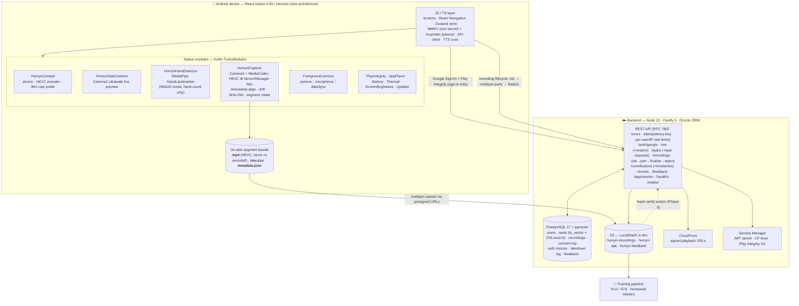

# Humyn Labs Capture — _Homelander_

> **Real Humyns. Real Intelligence.**

Android-first React Native app that records strict-spec **egocentric (head-mounted) video + IMU streams** of everyday tasks. The captured data trains physical / embodied AI — vision-language-action & vision-language-navigation models, humanoid robotics. _Homelander_ is the codename; the shipping product is **Humyn Labs Capture**.

The MVP ships as a **signed APK direct to users** in India and Brazil, ages 18–35, on ₹30K+-class phones. (A Play Store staged rollout and an iOS App Store channel — plus the iOS native-module analogues — are deferred to a follow-on milestone.)

---

## Why capture quality is the whole point

Every uploaded segment must hit a hard spec — devices/codecs that can't deliver are rejected at the on-device compatibility check before a user ever records:

| Property           | Requirement                                                                                                                   |
| ------------------ | ----------------------------------------------------------------------------------------------------------------------------- |
| Video              | 1080p · 30 FPS · HEVC, recorded on the **back ultrawide** physical sub-camera (≥ **110° dFOV**), AF off + fixed focus         |
| IMU                | accel + gyro, sustained **≥ 100 Hz**                                                                                          |
| Video ↔ IMU drift | `imu_video_drift_{max,mean,p99}_ms` is **measured and recorded** in every segment's `metadata.json` as fleet-health telemetry |
| Files              | MP4 / IMU CSV / metadata JSON travel **byte-for-byte** device → S3, never re-encoded                                          |
| Endurance          | 25-min sustained capture on Pixel 7a-class hardware, ≤ 8 % battery drain, no thermal cut-out                                  |

> The original `±1 ms` drift gate was relaxed by the project owner on 2026-05-12: driving the ultrawide sub-camera (needed to actually reach ≥ 110° dFOV) routes through a heavy distortion-correction pipeline that regresses drift to ~1.7–6.2 ms. The three drift figures are still computed and stored per segment; they no longer gate phase completion, smoke sign-off, finalization, or uploads. Full write-up: [`ULTRAWIDE-DRIFT-FINDINGS.md`](./ULTRAWIDE-DRIFT-FINDINGS.md). Audio was dropped on 2026-05-11 for similar drift reasons — the training pipeline consumes video + IMU only.

See [`idea-brief.md`](./idea-brief.md) §2.1 for the canonical capture spec, `IMU-FORMAT.md` / [`IMU-DRIFT-METHODOLOGY.md`](./IMU-DRIFT-METHODOLOGY.md) for the stream/metadata formats, and [`CLAUDE.md`](./CLAUDE.md) for the full set of locked constraints and the pinned tech stack.

---

## Architecture



### How the pieces fit

**Mobile app (`apps/mobile/`)** — RN 0.83 on Hermes, new architecture only. The JS/TS layer owns the entire non-recording surface: Splash → Sign-up (Google) → runtime permissions → behavioral compatibility check → rig + practice-recording tutorial → Home (task tiles) / Tasks / History / Profile / Help Center, plus a Forced-Upgrade gate. Navigation is React Navigation (native stack + bottom tabs); app state is Zustand; non-secret persistence is MMKV (encrypted), tokens live in Keychain; the recording-cue voice is `react-native-tts`. The on-device upload queue is owned client-side (no third-party background-fetch lib). Capture-spec values, hand-gate behaviour, and the recording-surface state machine are all driven verbatim from the locked design sources (`prototype.html`, `design-spec.md`, `engineering-handoff.md`).

**Native modules (`apps/mobile/android/app/src/main/java/ai/humynlabs/capture/`)** — hand-rolled Kotlin TurboModules, because the off-the-shelf camera libraries can't reach the physical sub-cameras or expose the HEVC controls (B-frames, bitrate mode, latency) the spec needs. The load-bearing ones:

- **`HumynCapture`** — the critical-path module. A Camera2 capture session feeding a MediaCodec HEVC encoder, recording on the **back ultrawide** sub-camera (it drives `CONTROL_ZOOM_RATIO` to the lower bound of the logical back camera's zoom range, AF off, fixed focus). In parallel it samples accel + gyro via `SensorManager` at ≥ 100 Hz, writes the IMU CSV, computes video↔IMU drift, SHA-256-hashes the outputs, rotates segments on a timer, and composes `metadata.json`. Runs inside an Android 14+ foreground service typed `camera｜microphone｜dataSync`.
- **`HumynGateCamera`** — a separate Camera2-fed `TextureView` preview (also on the ultrawide, AF off) shown from the recording screen's `ready` substate through the hand gate so the operator/helper can check rig placement and hands-in-frame before pressing Start. Released before `HumynCapture` opens its own Camera2 session — only one back-camera client at a time.
- **`HumynHandDetector`** — ~95 LOC over MediaPipe's `HandLandmarker` (`hand_landmarker.task`, ~7.8 MB, bundled `noCompress` so it can be memory-mapped), IMAGE mode, single-frame, **hand-count only**. Frames come from `HumynGateCamera.captureFrame()` (a JPEG to `cacheDir/hand-gate/`). This is the one-shot anti-fraud / framing gate before a recording can start. Mirrors Figure's pattern.
- **`HumynCompat`** — the pre-flight gate: probes device class, HEVC encoder capabilities (parses NAL units), and the IMU's achievable sustained rate, so incompatible hardware is rejected before the user ever sees the recording surface.
- Supporting modules: `PlayIntegrity` (Standard requests, Google-managed decryption; bypassed for the APK flavor via Remote Config), `AppFlavor`, `HumynBattery`, `HumynPhoneState` (thermal/distress signals), `HumynScreenBrightness`, `HumynUpdater` (in-app APK update channel), `HumynBeep` (capture cue tones), plus the foreground-service plumbing.

**Backend (`apps/api/`)** — a Fastify 5 service on Node 22, Drizzle ORM over PostgreSQL 17 (+ pgvector), S3 for blobs (LocalStack in dev). It exposes every REST endpoint in the spec — Google Sign-In + Play-Integrity auth (mints an HS256 JWT), profile CRUD + soft-delete/restore, the task catalogue + task-request submissions, the recording lifecycle (`init` → `complete-part` → `finalize` / `reject` — multipart S3 with presigned URLs), `/contributions` aggregates + timeseries, `/events`, `/feedback`, `/app/version`, and `healthz`/`readyz`. Cross-cutting concerns are Fastify plugins: RFC 7807 problem-details errors, `Idempotency-Key` handling, per-user/IP rate limits, request IDs, structured Pino logging, Zod request/response validation. Task search at MVP is the lexical `ts_vector` + GIN path (the pgvector + Reciprocal-Rank-Fusion hybrid layer is built but not surfaced to the MVP client). Legal/consent text is hashed and the consent timestamp + version is logged server-side; coarse location only — no precise GPS leaves the device. There's also a DSR (data-subject-request) export/hard-delete ops path and a takedown log.

**Shared types (`shared/types/`)** — Zod schemas + inferred TypeScript types shared between the API and the mobile client (recording metadata, task, auth, contributions, app-version, events, feedback, compat result, capture-session opts).

**Infra (`infra/`)** — Terraform modules for the AWS prod/staging footprint (S3, CloudFront, RDS, ECS, IAM, Secrets Manager, network) and LocalStack init scripts (bucket creation + secret seeding) for local dev. `docker-compose.yml` brings up Postgres 17 + LocalStack 4.x + pgAdmin.

**Upload pipeline** — the server side (multipart `recordings` routes, presigned URLs, S3 lifecycle) is in place; the client-side `HumynUpload` native module and the BullMQ hash-verify worker are **Phase 5** (not yet implemented — see Project status).

---

## Repository layout

```
.
├── apps/
│   ├── api/                 # Fastify + Drizzle + Postgres + S3 backend
│   │   ├── src/
│   │   │   ├── routes/      # /auth /me /tasks /recordings /contributions /events /feedback /app-version /healthz /readyz
│   │   │   ├── plugins/     # auth · error-handler · idempotency · logger · rate-limit · request-id · zod
│   │   │   ├── auth/        # Google ID-token verify · Play Integrity · JWT mint · install-source bypass
│   │   │   ├── db/          # Drizzle schema + SQL migrations
│   │   │   ├── legal/       # consent text + hashing + boot guard
│   │   │   ├── lib/         # s3 client · embedder · recording-state · problem-detail · idempotency-store
│   │   │   └── cron/        # DSR hard-delete
│   │   └── scripts/         # migrate · seed-tasks · legal-hash · dsr-export · parse-taxonomy
│   └── mobile/              # React Native 0.83 client (npm, not pnpm — see pnpm-workspace.yaml note)
│       ├── src/
│       │   ├── screens/     # splash · signup · permissions · compat · tutorial · home · tasks · history · recording · profile · help · force-upgrade
│       │   ├── native/      # TS facades for the Kotlin modules (HumynCapture · HumynGateCamera · HumynHandDetector · HumynCompat · …)
│       │   ├── navigation/  # root native stack · onboarding stack · main tabs · deep linking
│       │   ├── services/    # api · auth · compat · feedback · profile · telemetry · upgrade · version
│       │   ├── state/       # zustand store · hydrate · MMKV keys · initial route
│       │   ├── ui/          # design-token primitives (Button · Field · Text · Modal · Sheet · …)
│       │   ├── boot/ hooks/ lib/ util/
│       └── android/         # native project: app/src/main/java/ai/humynlabs/capture/{capture,gatecamera,handdetector,compat,fgs,battery,...}
├── shared/types/            # Zod schemas + TS types shared by api ⇄ mobile
├── infra/
│   ├── terraform/           # AWS modules (s3 · cloudfront · rds · ecs · iam · secrets · network) + envs (staging · prod)
│   └── localstack/init/     # dev bucket creation + secret seeding
├── scripts/dev-up.sh        # bring up Postgres + LocalStack + pgAdmin and wait for health
├── docker-compose.yml
├── idea-brief.md            # canonical capture spec + product brief (LOCKED)
├── design-spec.md · engineering-handoff.md · prototype.html   # design source of truth (LOCKED)
├── IMU-FORMAT.md · IMU-DRIFT-METHODOLOGY.md · ULTRAWIDE-DRIFT-FINDINGS.md
├── help-center-content.md · task-taxonomy.md · deferred-decisions.md · strategic-suggestions.md
├── CLAUDE.md                # locked constraints, pinned stack, "do not use" list, dev guidance
└── .planning/               # GSD planning artifacts: ROADMAP · STATE · REQUIREMENTS · per-phase plans / smoke walks / debug sessions
```

(`research/STACK.md`, referenced by `CLAUDE.md`, lives under `.planning/research/`.)

---

## Local development

### Prerequisites

- **Node 22 LTS** + **pnpm 9** (root workspace — `.nvmrc`)
- **Docker** (Postgres 17 + LocalStack 4.x + pgAdmin via `docker-compose`)
- For the mobile app: **JDK 17 (Zulu)**, Android SDK with `compileSdk=35` / `minSdk=26`, **AGP 8.7+ / Gradle 8.11+ / Kotlin 2.0.21+**, and a **Pixel 7a-class physical device** (an emulator fails Play Integrity by design and can't exercise the camera/IMU path)

### Backend + infra

```sh
# 1. Start Postgres 17 + pgvector, LocalStack (S3 + Secrets Manager), pgAdmin
./scripts/dev-up.sh

# 2. Install workspace deps (api + shared types)
pnpm install

# 3. Configure env, apply the schema, run the API
cp .env.example .env          # dev defaults already point at the docker services
cd apps/api
pnpm db:migrate               # apply SQL migrations
pnpm seed:tasks               # load the task catalogue
pnpm dev                      # tsx watch — API on :8080
```

Useful API scripts: `pnpm test` / `pnpm test:e2e` (Vitest), `pnpm db:generate` / `pnpm db:push` (Drizzle Kit), `pnpm legal:hash`, `pnpm dsr:build-export`. pgAdmin is at `http://localhost:5050` (`admin@humyn.local` / `admin`); LocalStack at `:4566`.

### Mobile app

```sh
cd apps/mobile
npm ci                                  # the mobile package uses npm, not pnpm

# Per-flavor env (react-native-config reads the matching file at compile time):
#   apps/mobile/.env.apkRollout   →  GOOGLE_WEB_CLIENT_ID, API_BASE_URL (e.g. http://10.0.2.2:8080)
#   apps/mobile/.env.playStore    →  same keys
# Firebase: download google-services.json for ai.humynlabs.capture.apk, then:
#   bash scripts/setup-google-services.sh ~/Downloads/google-services.json

npm run typecheck
npm run test                            # Vitest

# Build & run on a connected device — apkRollout debug variant:
npm run prebuild                        # build help content + link assets
cd android && ./gradlew :app:assembleApkRolloutDebug
```

Two build flavors: **`apkRollout`** (`applicationId=ai.humynlabs.capture.apk`, the direct-to-users APK — eligible for the install-source bypass) and **`playStore`** (`applicationId=ai.humynlabs.capture`, the strict-integrity Play Store track). See [`apps/mobile/README.md`](./apps/mobile/README.md) for the full flavor/signing breakdown.

### Repo-wide

```sh
pnpm lint            # eslint, all packages
pnpm typecheck       # tsc --noEmit, all packages
pnpm test            # vitest, all packages
pnpm format          # prettier --write
```

Pre-commit hooks (Husky + lint-staged) run eslint + prettier on staged `.ts/.tsx` and prettier on `.json/.md`.

---

## Project status

Built on the [GSD](https://github.com/glittershark/get-shit-done) phased workflow (planning artifacts in `.planning/` — `ROADMAP.md`, `STATE.md`, `REQUIREMENTS.md`, and per-phase plans / smoke walks / debug sessions).

| Phase                                                           | Scope                                                                                                                                                                   | Status               |
| --------------------------------------------------------------- | ----------------------------------------------------------------------------------------------------------------------------------------------------------------------- | -------------------- |
| **1 — Foundation, Backend & Distribution Recon**                | Monorepo, Fastify + Postgres + S3 backend with all REST endpoints, build flavors, S3 lifecycle, legal-review track, compat-recon APK                                    | ✅ done (2026-05-08) |
| **2 — Mobile Shell, Onboarding, Permissions, Compat & Profile** | RN shell: Splash → Sign-up → Permissions → behavioral Compat-check → Tutorial chrome → Profile → Help Center → Forced-Upgrade gate                                      | ✅ done (2026-05-10) |
| **3 — HumynCapture Native Module**                              | Camera2 + MediaCodec HEVC + IMU CSV + metadata JSON with timestamp alignment, drift, hashing, segmentation (audio dropped 2026-05-11)                                   | ✅ done (2026-05-11) |
| **4 — HandDetector, Recording UX & Practice Tutorial**          | MediaPipe hand gate + landscape recording-surface state machine + thermal / battery / TTS / lifecycle edges + practice-recording integration                            | ✅ done (2026-05-12) |
| **5 — Upload Pipeline, Hash-Verify Worker & Anti-fraud**        | `HumynUpload` (multipart S3, Android 14/15 FGS-type-downgrade + UIDT JobService) + BullMQ hash-verify worker + per-account upload-rate cap + pre-payout fraud dashboard | ⏳ next              |
| **6 — Tasks, History, Home Tiles & Lexical Search**             | Task catalogue + server-side `ts_vector` search, History grouped by day with in-app player, Home dynamic tiles                                                          | ⏳                   |
| **7 — Observability & APK Distribution Hardening**              | Firebase Analytics funnel, Crashlytics, structured CloudWatch logs, Bull-Board hash-verify dashboard, signed-APK pipeline hardening                                     | ⏳                   |

**Descoped from the MVP** (parked in `.planning/REQUIREMENTS.md` §v2): semantic / pgvector + RRF hybrid search on the client surface (backend layer shipped, just not surfaced), the server-side IMU-liveness fraud check, audio capture, the Play Store staged rollout, and the entire iOS App Store channel + iOS native-module analogues. MVP anti-fraud = Play Integrity at sign-in + per-account daily upload-rate cap + the on-device one-shot hand gate. MVP geos = India + Brazil, English only.

---

## Key documents

| File                                                                            | What it is                                                                                                |
| ------------------------------------------------------------------------------- | --------------------------------------------------------------------------------------------------------- |
| [`CLAUDE.md`](./CLAUDE.md)                                                      | Locked constraints, pinned tech-stack versions, "do not use" list, version-compat pinpoints, dev guidance |
| [`idea-brief.md`](./idea-brief.md)                                              | Canonical product brief + the capture spec (§2.1)                                                         |
| `design-spec.md` · `engineering-handoff.md` · `prototype.html`                  | Design source of truth — every screen, state, copy string, animation token                                |
| `IMU-FORMAT.md` · [`IMU-DRIFT-METHODOLOGY.md`](./IMU-DRIFT-METHODOLOGY.md)      | IMU CSV / metadata format; how the drift figures are computed                                             |
| [`ULTRAWIDE-DRIFT-FINDINGS.md`](./ULTRAWIDE-DRIFT-FINDINGS.md)                  | Why the ±1 ms drift gate was relaxed; mitigation options                                                  |
| `task-taxonomy.md` · [`help-center-content.md`](./help-center-content.md)       | Task catalogue source; in-app Help Center copy                                                            |
| [`deferred-decisions.md`](./deferred-decisions.md) · `strategic-suggestions.md` | Decisions deferred past MVP; product/strategy notes                                                       |
| `.planning/ROADMAP.md` · `.planning/STATE.md` · `.planning/REQUIREMENTS.md`     | Phase roadmap, current state, requirements (incl. §v2 deferred items)                                     |
| [`infra/terraform/README.md`](./infra/terraform/README.md)                      | AWS infra layout & bootstrap                                                                              |

---

_Internal project — © Humyn Labs._

_A few design/spec source files referenced above (`design-spec.md`, `engineering-handoff.md`, `prototype.html`, `IMU-FORMAT.md`, `task-taxonomy.md`, `strategic-suggestions.md`) live alongside the working tree and are not mirrored to this repository — they're shown as plain filenames, not links, for that reason. The `0.16.0.apk` / `apk-extracted/` / `jadx-out/` trees mentioned in planning notes are a third-party app used only as a reverse-engineering reference and are intentionally excluded too._
